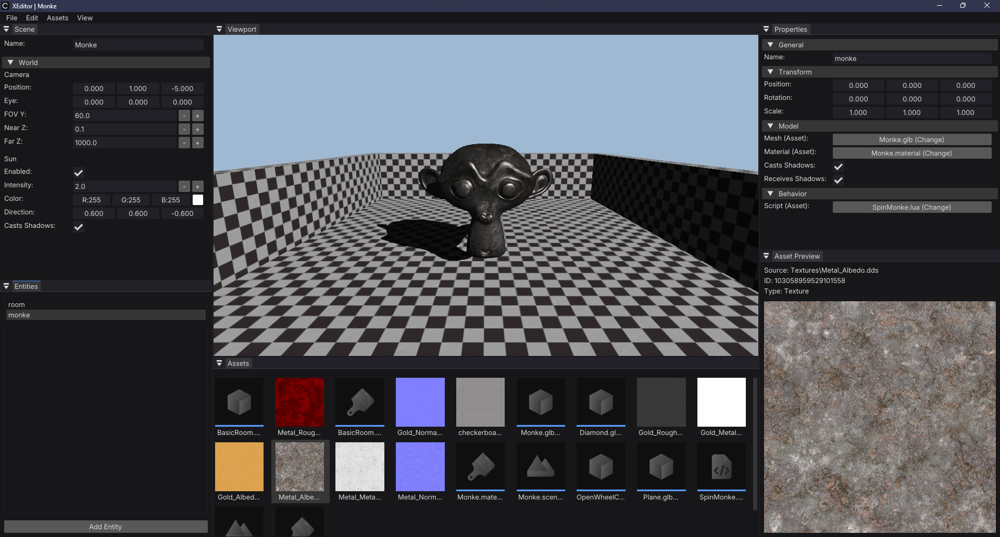

# Space Game

A prototype space exploration and survival game/engine built with DirectX 11.

## Project Structure

All the C++ code is in the aptly named [Code](Code) directory.
Shader sources can be found in [Engine/Shaders/Source](Engine/Shaders/Source).
The actual game executable code is in [Code/Game/main.cpp](Code/Game/main.cpp).

### Directories

- **Code** - C++ sources and headers
- **Docs** - Engine documentation
- **Engine** - Engine-specific assets, shader sources
- **Game** - Game content (scenes, materials, scripts, etc.)
- **Scripts** - Project configuration scripts

## Engine Architecture

If you'd like to know how the actual "engine" part of this code-base works, you can check out
the [Engine Architecture](Docs/Engine-Architecture.md) doc.


> [XEditor](Code/Tools/XEditor) - the main editing tool for the engine.

## Building

### ⚠️ This is a **Windows-only** project since it uses DirectX 11 and the Win32 API ⚠️

> This repo has been converted to a CMake build system. Visual Studio is **no longer required**.

### Quickstart

1. Clone the repository.

```bash
git clone https://github.com/jakerieger/SpaceGame.git
```

2. Configure with CMake.

```bash
cd SpaceGame
mkdir build && cd build
cmake .. -G "Visual Studio 17 2022" -A x64
```

3. Build and run.

```bash
cmake --build . --config <Debug/Release/Dist>
```

## Docs

- [Engine Architecture](Docs/Engine-Architecture.md)
    - Basic overview of how the engine is designed and structured.
- [Developer Console](Docs/Developer-Console.md)
    - Documentation for in-game developer console.
- [Design Doc](Docs/Design-Doc.md)
    - Game outline and design goals.
- [Development Log](Docs/Development-Log.md)
    - Timestamped dev log, mostly for me and my poor memory.