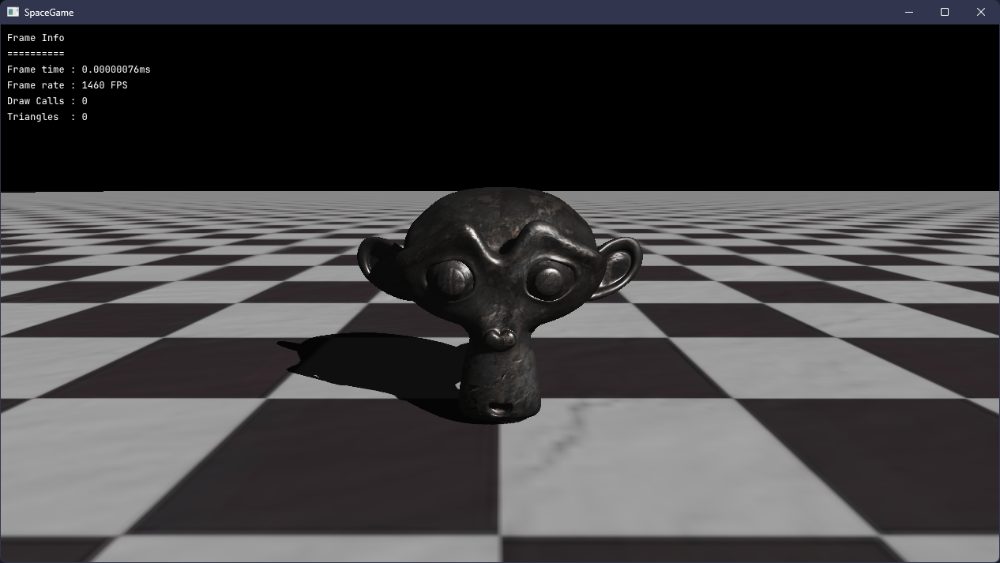

# Space Game

A protoype space exploration game/engine built using DirectX 11.

## Project Structure

All of the C++ code is in the aptly named directory [Code](Code). Shader sources can be found in [Engine/Shaders/Source](Engine/Shaders/Source).

The actual game executable code is in [Code/Game/main.cpp](Code/Game/main.cpp).

## Engine Architrecture

If you'd like to know how the actual "engine" part of this code-base works, you can check out the [Engine Architecture](Docs/Engine-Architecture.md) doc.

## Building

Building requires [Visual Studio 2022](https://visualstudio.microsoft.com/vs/). This is a **Windows-only** project since it uses DirectX 11 and the Win32 API 😔.

⚠️ **There are no plans currently to port this to other platforms.** ⚠️

### Dependencies

Most of the third party dependencies are included in the [Code/Vendor](Code/Vendor) directory.
However, `Engine` requires [DirectXTex](https://github.com/microsoft/DirectXTex) which must be installed via [NuGet](https://www.nuget.org/).

[Assimp](https://github.com/assimp/assimp) must also be built or installed locally and the `Additional Libraries` property of the `Engine` project updated to link to this. The headers
are already included in [Code/Vendor](Code/Vendor).

After those two things are done, you just need to set `Game` as the startup project and build.

> I may move to a Git Submodule system in the future, but this is not a project I'm releasing as open-source (as in licensed and contributable), so the ability for others to compile it is, in all honesty, *not* a consideration of mine.

## Screenshots

> Shadow maps
