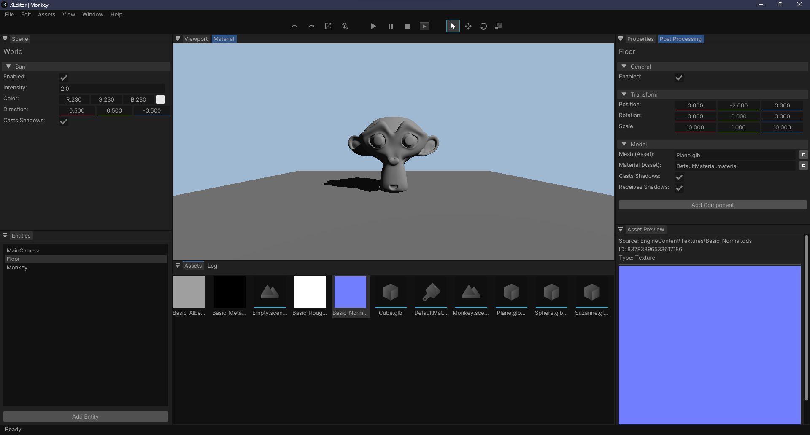

---

**XEN**GINE (or XEN for short) is a custom 3D game engine built for Windows from the ground up as both a learning project and fully functional toolsuite for developing games.

It boasts a modest forward renderer, entity component system, fully (kind of) integrated editor, and an asset management system for packing and shipping game content.

Entity behavior and scripting is handled by a JIT-compiled Lua runtime, and the engine core itself is quite lightweight and modular, compiling to a small static library that can be linked to any Windows C++ application one wishes.

> [XEditor](Code/Tools/XEditor) - the main editing tool for the engine