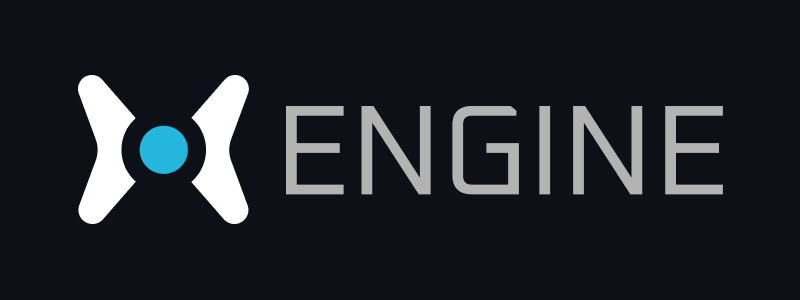

---

**XEN**GINE (or XEN for short) is a custom 3D game engine built for Windows from the ground up as both a learning project and fully functional toolsuite for developing games.

It boasts a modest forward renderer, entity component system, fully integrated editor, and an asset management system for packing and shipping game content.

Entity behavior and scripting is handled by a JIT-compiled Lua runtime (thanks to LuaJIT), and the engine core itself is quite lightweight and modular, compiling to a small static library that can be linked to any Windows C++ application one wishes.

## Modules

### X

**X** is the **core engine library**. It's compiled as a static library and almost every other module in this
project links to it. 

> Its source can be found in [Code/Engine](Code/Engine).

### XEditor

**XEditor** is the primary editor and game authoring tool. It provides a GUI that is fully integrated with the engine
and is comparable in nature to the Unity editor or Unreal Engine's editor.

> Its source can be found in [Code/Tools/XEditor](Code/Tools/XEditor).

### XPak

**XPak** is an asset packer and management tool. It's split into two components: **xpak**, which is a static
library containing the asset management API used by the engine core and XEditor, and **xpakc**, which is a command-line utility that can be used to
process assets outside XEditor. Its core functions include generating asset descriptor files, packing assets for distribution,
and unpacking or parsing pak files for debugging purposes.

> Its source can be found in [Code/Tools/XPak](Code/Tools/XPak).

### ResPak

**ResPak** is an internal command-line utility used to compress and pack image resources into header files
so they can be easily embedded in other GUI tools such as XEditor. It uses Brotli for compression.

> Its source can be found in [Code/Tools/ResPak](Code/Tools/ResPak).